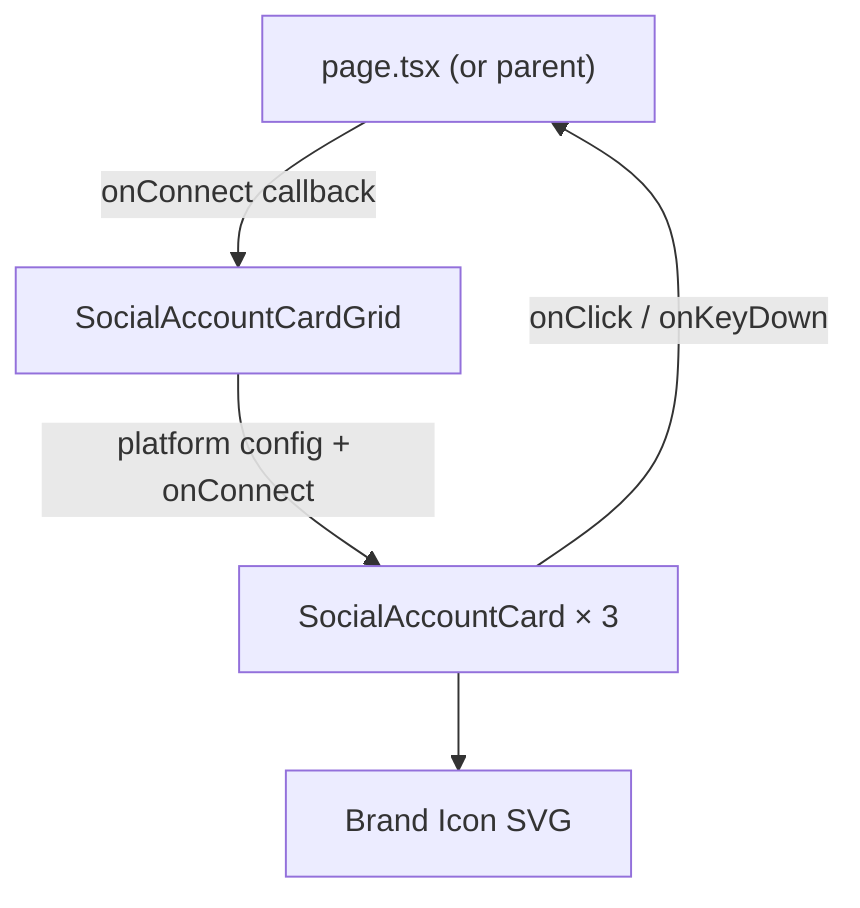

# Design Document: Social Account Cards

## Overview

This feature adds a set of interactive social account cards to the clips-frontend Next.js application. Three cards — TikTok, Instagram, and YouTube — are arranged in a responsive three-column grid. Each card displays a brand icon, platform name, and connection subtext. Cards respond to hover with a smooth 200ms border/background transition and are fully keyboard-accessible.

The implementation is purely presentational with a callback prop for the connection action, keeping the component decoupled from any specific auth or routing logic.

## Architecture

The feature is composed of two React components living under `app/components/`:

```
app/components/
  SocialAccountCard.tsx   — single card (icon, label, subtext, hover, a11y)
  SocialAccountCardGrid.tsx — three-column responsive grid of three cards
```

Both are client components (`"use client"`) because hover state is managed via Tailwind's `group` / `hover:` utilities (no JS state needed for the transition itself). The grid component owns the platform configuration array and renders three `SocialAccountCard` instances.

Brand icons are inline SVG components co-located in `app/components/icons/` so there is no external icon dependency and no network fetch that could fail.

```
app/components/icons/
  TikTokIcon.tsx
  InstagramIcon.tsx
  YouTubeIcon.tsx
```

### Data Flow



## Components and Interfaces

### SocialAccountCard

```ts
interface SocialAccountCardProps {
  platform: "tiktok" | "instagram" | "youtube";
  label: string;           // e.g. "TikTok"
  subtext: string;         // e.g. "Connect your TikTok account"
  icon: React.ReactNode;   // brand SVG element
  onConnect: (platform: string) => void;
}
```

Responsibilities:
- Renders icon, label, subtext
- Applies hover styles via Tailwind `transition-all duration-200 ease-in-out` + `hover:` variants
- Handles `onClick`, `onKeyDown` (Enter / Space) for keyboard activation
- Exposes `aria-label` and `role="button"` / `tabIndex={0}` for accessibility
- Falls back to platform label text if icon slot is empty (icon prop is optional at runtime)

### SocialAccountCardGrid

```ts
interface SocialAccountCardGridProps {
  onConnect: (platform: string) => void;
}
```

Responsibilities:
- Defines the static platform config array (platform, label, subtext, icon)
- Renders a `div` with `grid grid-cols-1 md:grid-cols-3 gap-4` (≥16px gap, single-column below 768px)
- Maps config to `SocialAccountCard` instances

### Brand Icon Components

Each icon is a simple functional component accepting standard SVG props (`className`, `aria-hidden`). They render inline SVG paths matching official brand colors.

```ts
interface IconProps {
  className?: string;
}
// TikTokIcon, InstagramIcon, YouTubeIcon all share this interface
```

## Data Models

### PlatformConfig (internal to SocialAccountCardGrid)

```ts
type PlatformConfig = {
  platform: "tiktok" | "instagram" | "youtube";
  label: string;
  subtext: string;
  icon: React.ReactNode;
};

const PLATFORMS: PlatformConfig[] = [
  {
    platform: "tiktok",
    label: "TikTok",
    subtext: "Connect your TikTok account",
    icon: <TikTokIcon className="h-10 w-10" aria-hidden />,
  },
  {
    platform: "instagram",
    label: "Instagram",
    subtext: "Connect your Instagram account",
    icon: <InstagramIcon className="h-10 w-10" aria-hidden />,
  },
  {
    platform: "youtube",
    label: "YouTube",
    subtext: "Connect your YouTube account",
    icon: <YouTubeIcon className="h-10 w-10" aria-hidden />,
  },
];
```

No server-side data fetching or persistence is required for this feature. Platform config is static.

## Correctness Properties

*A property is a characteristic or behavior that should hold true across all valid executions of a system — essentially, a formal statement about what the system should do. Properties serve as the bridge between human-readable specifications and machine-verifiable correctness guarantees.*

### Property 1: Grid renders exactly three cards

*For any* render of `SocialAccountCardGrid`, the output should contain exactly three `SocialAccountCard` elements — one for each of TikTok, Instagram, and YouTube.

**Validates: Requirements 1.1, 1.4**

---

### Property 2: Each card displays its platform label and subtext

*For any* platform configuration, the rendered `SocialAccountCard` should contain both the platform label string and the subtext string in its output.

**Validates: Requirements 2.2, 2.3**

---

### Property 3: Icon fallback on missing icon

*For any* `SocialAccountCard` rendered with no icon (icon prop omitted or null), the card should display the platform label text in place of the icon.

**Validates: Requirements 2.4**

---

### Property 4: onConnect fires with correct platform on click

*For any* platform value, clicking the corresponding `SocialAccountCard` should invoke `onConnect` exactly once with that platform's identifier.

**Validates: Requirements 4.1**

---

### Property 5: Keyboard activation fires onConnect

*For any* `SocialAccountCard`, pressing Enter or Space while the card is focused should invoke `onConnect` exactly once with the correct platform identifier.

**Validates: Requirements 4.2**

---

### Property 6: aria-label contains platform name

*For any* `SocialAccountCard`, the element's `aria-label` attribute should contain the platform name string.

**Validates: Requirements 4.3**

---

### Property 7: Hover transition duration is 200ms

*For any* `SocialAccountCard`, the computed CSS transition duration on the card element should be 200ms.

**Validates: Requirements 3.2, 3.3**

---

### Property 8: Hover does not shift layout dimensions

*For any* `SocialAccountCard`, the bounding box dimensions (width and height) should be identical before and after entering the hover state.

**Validates: Requirements 3.4**

## Error Handling

| Scenario | Behavior |
|---|---|
| Icon SVG fails to render (e.g. import error) | `SocialAccountCard` catches the missing icon via a conditional render check; displays platform label text as fallback (Requirement 2.4) |
| `onConnect` prop not provided | TypeScript enforces the prop as required; no runtime error possible in typed usage |
| Unknown platform string passed | TypeScript union type `"tiktok" \| "instagram" \| "youtube"` prevents unknown values at compile time |
| Viewport too narrow for grid | Tailwind responsive classes collapse to single-column automatically; no JS error |

No async operations are involved in this feature, so there are no loading or network error states to handle.

## Testing Strategy

### Dual Testing Approach

Both unit tests and property-based tests are used. Unit tests cover specific examples and integration points; property tests verify universal behaviors across generated inputs.

### Unit Tests

Located at `app/components/__tests__/`:

- `SocialAccountCard.test.tsx` — renders label, subtext, icon; fires `onConnect` on click; fires on Enter/Space keydown; renders fallback when icon is null; has correct `aria-label`
- `SocialAccountCardGrid.test.tsx` — renders exactly three cards; each card has the correct platform; grid has correct responsive class

Use React Testing Library (`@testing-library/react`) with `vitest`.

### Property-Based Tests

Use **fast-check** (`npm install --save-dev fast-check`) for property-based testing. Each test runs a minimum of **100 iterations**.

Located at `app/components/__tests__/SocialAccountCard.property.test.tsx`.

Each test is tagged with a comment in the format:
`// Feature: social-account-cards, Property N: <property_text>`

Properties to implement:

| Test | Design Property | fast-check Approach |
|---|---|---|
| Grid always renders 3 cards | Property 1 | Arbitrary `onConnect` fn; assert card count === 3 |
| Card renders label + subtext | Property 2 | Arbitrary label/subtext strings; assert both present in output |
| Icon fallback | Property 3 | Render with `icon={null}`; assert label text appears |
| Click fires onConnect with platform | Property 4 | Arbitrary platform from union; assert callback called with correct value |
| Keyboard fires onConnect | Property 5 | Arbitrary key from `["Enter", " "]`; assert callback called |
| aria-label contains platform name | Property 6 | Arbitrary platform; assert aria-label includes label string |
| Hover transition is 200ms | Property 7 | Render card; assert `transition-duration` class maps to 200ms |
| Hover preserves dimensions | Property 8 | Render card; compare bounding box before/after hover simulation |

### Test Configuration

```ts
// vitest.config.ts
import { defineConfig } from "vitest/config";
export default defineConfig({
  test: {
    environment: "jsdom",
    globals: true,
    setupFiles: ["./vitest.setup.ts"],
  },
});
```

Required dev dependencies:
```
vitest
@testing-library/react
@testing-library/user-event
@testing-library/jest-dom
fast-check
jsdom
```
